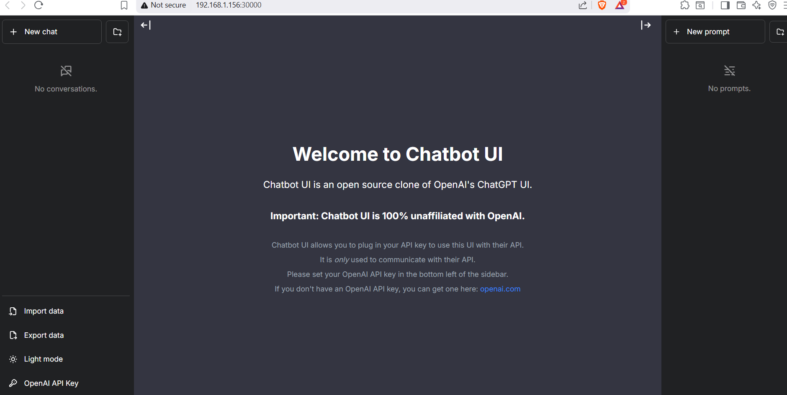
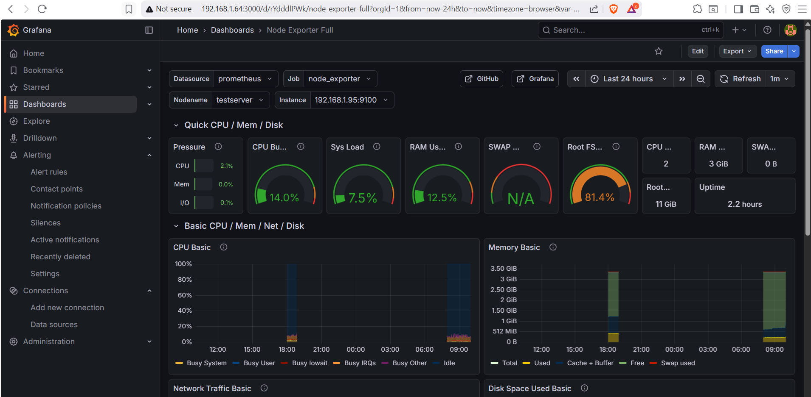
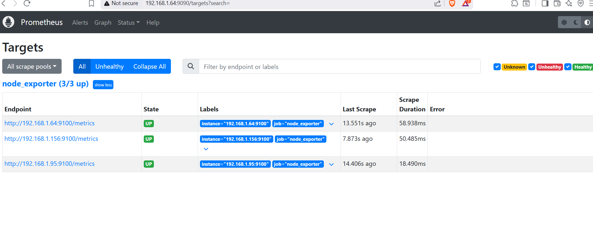

# Chatbot DevOps Project

A complete DevOps implementation of a ChatGPT-like chatbot application with full CI/CD pipeline, Kubernetes deployment, and monitoring.

[]()
[]()
[]()
[]()

## 📋 Table of Contents

- [Project Overview](#project-overview)
- [Architecture](#architecture)
- [Technologies Used](#technologies-used)
- [Infrastructure Setup](#infrastructure-setup)
- [Quick Start](#quick-start)
- [CI/CD Pipeline](#cicd-pipeline)
- [Kubernetes Deployment](#kubernetes-deployment)
- [Monitoring & Alerts](#monitoring--alerts)
- [Backup & Recovery](#backup--recovery)
- [Troubleshooting](#troubleshooting)
- [Contributing](#contributing)

## 🎯 Project Overview

This project demonstrates a production-grade DevOps workflow by deploying an AI chatbot application with:

- **Automated CI/CD** using Jenkins
- **Containerization** with Docker
- **Orchestration** with Kubernetes (kubeadm)
- **Infrastructure as Code** with Vagrant
- **Monitoring** with Prometheus & Grafana
- **Automated Backups** with Cron jobs

**Live Application:**
- Worker 1: http://192.168.1.156:30000
- Worker 2: http://192.168.1.95:30000

## 🏗️ Architecture

```
Developer → GitHub → Jenkins CI/CD → Docker Hub → Kubernetes Cluster
                                                         ↓
                                              ┌──────────┼──────────┐
                                              │          │          │
                                           Master    Worker1    Worker2
                                          (8GB/4CPU) (4GB/2CPU) (2GB/2CPU)
                                              │          │          │
                                         Prometheus  5 Pods     5 Pods
                                         Grafana
                                         Jenkins
```

### VM Infrastructure

| VM | Hostname | IP | RAM | CPU | Role |
|----|----------|-----|-----|-----|------|
| Master | linuxserver | 192.168.1.64 | 8GB | 4 | Control Plane + Jenkins + Monitoring |
| Worker 1 | aserver | 192.168.1.156 | 4GB | 2 | Application Pods |
| Worker 2 | testserver | 192.168.1.95 | 2GB | 2 | Application Pods |

## 🛠️ Technologies Used

### Application
- **Frontend/Backend:** Next.js 13 (React + TypeScript)
- **AI Integration:** OpenAI API
- **Package Manager:** npm

### DevOps Stack
- **Version Control:** Git, GitHub
- **CI/CD:** Jenkins
- **Containerization:** Docker, Docker Compose
- **Container Registry:** Docker Hub
- **Orchestration:** Kubernetes 1.31 (kubeadm)
- **Networking:** Flannel CNI
- **Monitoring:** Prometheus, Grafana, Node Exporter
- **Infrastructure as Code:** Vagrant
- **OS:** Ubuntu 22.04 LTS
- **Virtualization:** Oracle VirtualBox

## 🚀 Infrastructure Setup

### Option 1: Automated Setup (Vagrant)

```bash
# Prerequisites: Vagrant & VirtualBox installed

cd vagrant/
vagrant up

# Wait 10-15 minutes for cluster to initialize
vagrant ssh master
kubectl get nodes
```

See [vagrant/VAGRANT-README.md](vagrant/VAGRANT-README.md) for details.

### Option 2: Manual Setup

1. **Create 3 VMs** with Ubuntu 22.04
2. **Install Kubernetes** on all nodes:
   ```bash
   bash vagrant/scripts/install-k8s.sh
   ```
3. **Initialize Master:**
   ```bash
   sudo kubeadm init --pod-network-cidr=10.244.0.0/16 --apiserver-advertise-address=<master-ip>
   kubectl apply -f https://raw.githubusercontent.com/flannel-io/flannel/master/Documentation/kube-flannel.yml
   ```
4. **Join Workers:**
   ```bash
   sudo kubeadm join <master-ip>:6443 --token <token> --discovery-token-ca-cert-hash sha256:<hash>
   ```

## 🎬 Quick Start

### Deploy Application

```bash
# Clone repository
git clone https://github.com/Dusky88/chatbot-devops-project.git
cd chatbot-devops-project

# Deploy to Kubernetes
kubectl apply -f k8s/chatbot-ui.yaml

# Verify deployment
kubectl get pods -o wide
kubectl get services

# Access application
# http://<worker-ip>:30000
```

### Local Development

```bash
cd Chatbot-UI

# Install dependencies
npm install

# Run development server
npm run dev

# Build for production
npm run build
npm start
```

### Docker

```bash
# Build image
docker build -t chatbot:latest ./Chatbot-UI

# Run container
docker-compose up

# Access at http://localhost:3000
```

## 🔄 CI/CD Pipeline

### Jenkins Pipeline Stages

1. **Checkout** - Pulls code from GitHub (staging branch)
2. **Install Dependencies** - Runs `npm ci`
3. **Lint** - Code quality checks with ESLint
4. **Build Image** - Creates Docker image with build tag
5. **Push to Docker Hub** - Publishes image to dusky88/chatbot
6. **Deploy** - Runs container for testing

### Pipeline Triggers

- Automatic: Push to `staging` branch
- Manual: Click "Build Now" in Jenkins UI

### Credentials Required

- `github-creds`: GitHub Personal Access Token
- `dockerhub-creds`: Docker Hub username/password

**Jenkins URL:** http://192.168.1.64:8080

## ☸️ Kubernetes Deployment

### Application Specs

```yaml
Replicas: 10 pods
Image: dusky88/chatbot:latest
Resources:
  CPU: 250m request, 500m limit
  Memory: 256Mi request, 512Mi limit
Service Type: NodePort
Port: 30000
```

### Pod Distribution

- **aserver:** 5 pods (10.244.1.x)
- **testserver:** 5 pods (10.244.2.x)

### Health Checks

- **Liveness Probe:** HTTP GET / (starts after 60s, every 30s)
- **Readiness Probe:** HTTP GET / (starts after 30s, every 10s)

### Scaling

```bash
# Scale to 15 pods
kubectl scale deployment chatbot-deployment --replicas=15

# Auto-scale based on CPU
kubectl autoscale deployment chatbot-deployment --min=5 --max=20 --cpu-percent=80
```

## 📊 Monitoring & Alerts

### Access Points

- **Prometheus:** http://192.168.1.64:9090
- **Grafana:** http://192.168.1.64:3000 (admin/admin)

### Metrics Collected

- **CPU Usage** - Per node and per pod
- **Memory Usage** - Available vs Total
- **Disk I/O** - Read/Write operations
- **Network Traffic** - Bytes sent/received

### Alert Rules

| Alert | Condition | Notification |
|-------|-----------|--------------|
| High CPU | > 80% for 1 min | Email to abasnetap@gmail.com |
| High RAM | > 80% for 1 min | Email to abasnetap@gmail.com |

### Dashboard

**Node Exporter Full** (ID: 1860) displays:
- Real-time CPU, RAM, Disk, Network graphs
- Individual metrics for all 3 nodes
- Historical data with customizable time ranges

## 💾 Backup & Recovery

### Automated Backups

**Schedule:** Daily at 10:00 PM UTC

**Files Backed Up:**
- Kubernetes resources (deployments, services, configmaps)
- Application manifests (k8s/chatbot-ui.yaml)
- Prometheus configuration
- Grafana configuration

**Location:** `/opt/backups/<date>/`

**Retention:** 7 days (older backups auto-deleted)

### Manual Backup

```bash
# Run backup script manually
sudo /opt/backups/backup.sh

# View backup logs
cat /opt/backups/backup.log

# List backups
ls -lh /opt/backups/
```

### Restore from Backup

```bash
# Restore Kubernetes resources
kubectl apply -f /opt/backups/2026-02-17/k8s-all.yaml

# Restore Prometheus config
sudo cp /opt/backups/2026-02-17/prometheus.yml /etc/prometheus/
sudo systemctl restart prometheus
```

## 🐛 Troubleshooting

### Pods Stuck in Pending

```bash
# Check node status
kubectl get nodes

# Describe pod to see error
kubectl describe pod <pod-name>

# Common fixes
sudo swapoff -a  # Disable swap
df -h  # Check disk space
```

### Application Not Accessible

```bash
# Verify service
kubectl get services

# Check pod logs
kubectl logs <pod-name>

# Test from inside cluster
kubectl run test --image=busybox --rm -it -- wget -O- http://chatbot-service:3000
```

### Jenkins Build Failing

```bash
# Check Jenkins logs
docker logs jenkins

# Verify credentials
# Go to Manage Jenkins → Credentials

# Test Docker Hub login
docker login
```

### Monitoring Not Working

```bash
# Check Prometheus targets
curl http://192.168.1.64:9090/targets

# Verify Node Exporter
curl http://192.168.1.64:9100/metrics

# Restart services
sudo systemctl restart prometheus
sudo systemctl restart grafana-server
```

## 📂 Project Structure

```
chatbot-devops-project/
├── Chatbot-UI/                 # Next.js application
│   ├── components/
│   ├── pages/
│   ├── public/
│   ├── Dockerfile              # Multi-stage Docker build
│   ├── package.json
│   └── next.config.js
├── k8s/                        # Kubernetes manifests
│   └── chatbot-ui.yaml         # Deployment + Service
├── vagrant/                    # Infrastructure as Code
│   ├── Vagrantfile            # 3-VM cluster setup
│   ├── scripts/
│   │   └── install-k8s.sh     # K8s installation script
│   └── VAGRANT-README.md
├── Jenkinsfile                # CI/CD pipeline definition
├── docker-compose.yml         # Local development
├── README.md                  # This file
└── .gitignore
```

## 🤝 Contributing

1. Fork the repository
2. Create your feature branch (`git checkout -b feature/amazing-feature`)
3. Commit your changes (`git commit -m 'Add amazing feature'`)
4. Push to the branch (`git push origin feature/amazing-feature`)
5. Open a Pull Request

## 📝 License

This project is licensed under the MIT License.

## 👨‍💻 Author

**Aayush Basnet**
- GitHub: [@Dusky88](https://github.com/Dusky88)
- Email: abasnetap@gmail.com

## 🙏 Acknowledgments

- Original Chatbot UI: [chatbot-ui](https://github.com/mckaywrigley/chatbot-ui)
- Kubernetes Documentation
- Jenkins Community
- Prometheus & Grafana Teams

## 📸 Screenshots

### Application Running


### Grafana Dashboard


### Promotheus State


### Jenkins Pipeline


---

**⭐ Star this repo if you found it helpful!**
